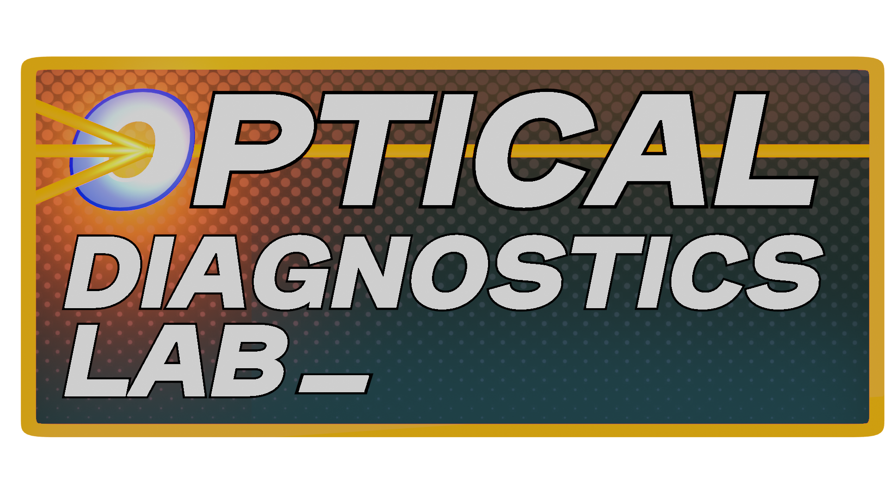
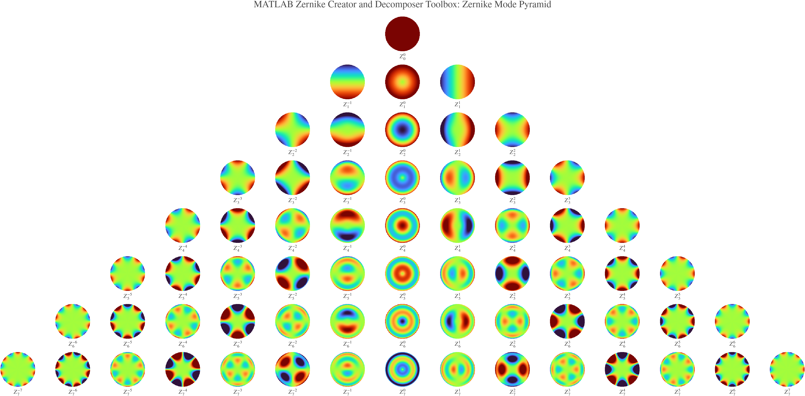

<p align="left">
  <a href="https://www.repostatus.org/#active"></a>
  
   <strong>NASA Open Science 101 Certified</strong>
</p>

***

# ***Zernike Creator and Decomposer Toolbox***
This MATLAB-based toolbox allows for the creation of closed-form and factorial-free Zernike modes, and the Zernike decomposition of wavefronts. Closed form equations can also be custom-made as strings and imported in the decomposition script.



***

## ***Table of Contents***
- [About the Developer](#about)
- [Features](#features)
- [Dependencies](#dependencies)
- [Installation](#installation)
- [quickZern function](#quickZern)
- [zernDecomp function](#zerndecomp)
- [plotZern function](#plotzern)
  
***

## ***About***
This code was generated at the Optical Diagnostics Lab at the New York Institute of Technology. 

Please cite this code as: 
[X] Hobert, Brianna (2026). Zernike Creator and Decomposer Toolbox Github/MATLAB Central File Exchange. Retrieved Month DD, YYYY. 

Acknowledgements: 
Beta tested by Jared Plotkin, Avinash Somwaru, Sean Peters, and Jim Scire. 

***

## ***Features***
Here is a list of what this toolbox can do:
* **Generation of closed-form Zernike equations as strings**: Close-form Zernike polynomials [1] can be acquired as strings and
evaluated using the eval function native to MATLAB.

* **Generation of factorial-free fractional modes:**: Fractional Zernikes can be generated using the Stirling [2], Burnside [3], and Mortici [4] approximations.

* **Decomposition of custom modes:** Seamlessly conduct the Moore-Penrose psuedoinverse of the Zernike matrix on a wavefront by adding in custom modes generated by quickZern. Decompose the wavefront with zernDecomp.

* **Plot 3D Wavefronts Efficiently:** Use plotZern to easily plot Zernike modes in 3D, with the right presets already at your fingertips.
  
* **Use simple examples:** Example files in this toolbox will help you get acquainted with each function.

***

## ***Dependencies***
* **MATLAB** to run these codes
* **MATLAB [Symbolic Math Toolbox](https://www.mathworks.com/products/symbolic.html)** to use variable precision arithmetic mode in quickzern. Other modes can be used if you do not have this addon.

***

## ***Installation***
Download the .zip and open any of the files in MATLAB. Alternatively, this package can be found in the MATLAB File Exchange. 

***
***

## ***quickZern***

Generates symbolic expressions and wavefronts for closed-form solutions and factorial-free* approximations of real-valued Zernike polynomials. The function returns the Zernike string solution and corresponding wavefronts for a specified radial mode and azimuthal frequency.

$$
\Delta Z_n^{|m|}(\rho,\theta)
$$

## Orthogonality Rules

For standard Zernike polynomials:

* $n$ and $|m|$ define the Zernike mode.
* $n \geq |m|$.
* $\rho$ and $\theta$ are the radial and angular coordinates, respectively.

> **Note:** Factorial-free approximations do not necessarily need to satisfy the standard Zernike orthogonality constraints.

---

## Syntax

```matlab
[zern,wf1,wf2,pupil]=quickZern(n,m,options)
```

## Inputs

| Input    | Description                                                           |
| -------- | --------------------------------------------------------------------- |
| `n`      | Radial mode.                                                          |
| `m`      | Azimuthal frequency. Always represented as the absolute value of $m$. |

## Optional Name-Value Inputs

# `showzerns`

Display the Zernike modes contained within the decomposition matrix.

| Name-Value | Description                                                |
| ---------- | ---------------------------------------------------------- |
| `gridsize` | Size of the preview grid used when `showzerns` is enabled. |
| `crange`   | Display range for preview images generated by `showzerns`. |

# `rms`

Use the root-mean-square (RMS) Zernike normalization convention.

# `mode`

Selects the solver used to calculate the Zernike radial polynomial.

| `mode`       | Description                                                                        |
| ------------ | ---------------------------------------------------------------------------------- |
| `'default'`  | Uses the standard closed-form equations.                                           |
| `'gammaln'`  | Uses MATLAB's `gammaln` functions to evaluate factorial terms in logarithmic form. |
| `'vpa'`      | Uses the default equations with MATLAB variable-precision arithmetic (`vpa`).      |
| `'stirling'` | Uses the Stirling approximation* [2].                                              |
| `'burnside'` | Uses the Burnside approximation* [3].                                              |
| `'mortici'`  | Uses the Mortici approximation* [4].                                               |

> **Note:** Factorial-free approximations do not necessarily need to satisfy the standard Zernike orthogonality constraints.

# `normalize`

Normalizes factorial-free results only. 

## Example
The following example uses each available solver to generate the defocus mode $Z_2^0$ and compares the resulting wavefronts visually.
Generate the Defocus Mode
```matlab
% Clear workspace
clc; close all; clear all;

% Generate defocus using different solvers
[def,Z20_def,~,~]      =quickZern(2,0,"mode","default");
[gamln,Z20_gamln,~,~]  =quickZern(2,0,"mode","gammaln");
[vp,Z20_vpa,~,~]       =quickZern(2,0,"mode","vpa");
[lstir,Z20_lstir,~,~]  =quickZern(2,0,"mode","stirling");
[burn,Z20_burn,~,~]    =quickZern(2,0,"mode","burnside");
[mort,Z20_mort,~,~]    =quickZern(2,0,"mode","mortici");
```
Compare the Results
```matlab
% Display range
crange=[-1,1];

% Compare results in a tiled layout
figure;
    h=tiledlayout(1,6);

        nexttile
            imagesc(Z20_def,crange)
            title('Default')
            axis image; axis off;

        nexttile
            imagesc(Z20_gamln,crange)
            title('gammaln')
            axis image; axis off;

        nexttile
            imagesc(Z20_vpa,crange)
            title('vpa')
            axis image; axis off;

        nexttile
            imagesc(Z20_lstir,crange)
            title('Stirling')
            axis image; axis off;

        nexttile
            imagesc(Z20_burn,crange)
            title('Burnside')
            axis image; axis off;

        nexttile
            imagesc(Z20_mort,crange)
            title('Mortici')
            axis image; axis off;

        colormap("turbo")
        colorbar
```
This produces a side-by-side comparison of the wavefront generated by each solver.

***
***

## ***zernDecomp***

Performs a Zernike decomposition on a wavefront image using the Moore-Penrose pseudoinverse of the Zernike matrix. The routine decomposes the input wavefront into a set of Zernike modes and returns the corresponding decomposition coefficients and residual wavefront.

## Syntax

```matlab
[coeffs,res,zer]=zernDecomp(image, options)
```

## Inputs

|Input|Description|
|-|-|
|`image`|Image representing the wavefront to be decomposed.|

## Optional Name-Value Inputs

# `showzerns`

Display the Zernike modes contained within the decomposition matrix.

|Name-Value|Description|
|-|-|
|`gridsize`|Size of the preview grid used when `showzerns` is enabled.|
|`crange`|Display range for preview images generated by `showzerns`.|

# `unwrap`

Calculate the phase of the input image and spatially unwrap the resulting phase. [5]

|Name-Value|Description|
|-|-|
|`showphase`|Display the unwrapped phase of the input image.|

# `addzerns`

Add custom Zernike equations to the decomposition.

The input must be an `{N×1}` cell array containing strings of custom Zernike equations generated using `quickZern`.

See [Add Custom Zernikes to Your Decomposition](#add-custom-zernikes-to-your-decomposition) and the example scripts included with this toolbox.

# `pupilsize`

Adjust the diameter of the pupil used for the decomposition.

The default pupil size is `1.0`. Valid values range from `0` to `1.0`.

|Name-Value|Description|
|-|-|
|`showpupil`|Display the pupil mask over the input wavefront.|


## Outputs

|Output|Description|
|-|-|
|`coeffs`|Zernike decomposition coefficient array.|
|`res`|Residual wavefront after Zernike decomposition.|
|`zer`|Zernike matrix used for the decomposition. [1]|


## Example

The following example generates an artificial wavefront using `quickZern` and then decomposes the resulting wavefront using `zernDecomp`. The decomposition can be used to verify that the original Zernike weights are recovered.

### Generate the Wavefront

```matlab id="8f3y5q"
% Clear workspace
clc; close all; clear all;

% Develop artificial wavefront
N=512;

[zern1,astig,~,~]=quickZern(2,2, ...
    "gridsize",N,"showzerns",1);

[zern2,~,coma,~]=quickZern(3,1, ...
    "gridsize",N,"showzerns",1);

[zern3,defocus,~,~]=quickZern(2,0, ...
    "gridsize",N,"showzerns",1);

[zern4,spherical,~,~]=quickZern(4,0, ...
    "gridsize",N,"showzerns",1);
```

### Linearly Weight the Components

```matlab id="f8g5ak"
% Linearly weight components
wavefront=0.3*astig+0.3*coma+0.4*spherical;
```

### Perform the Decomposition

```matlab id="k4b2qn"
% Decomposition
[coeffs,~,~]=zernDecomp(wavefront, ...
    "showzerns",true,"unwrap",false);
```

The resulting `coeffs` array contains the Zernike weights recovered from the artificial wavefront.


## Add Custom Zernikes to Your Decomposition

Custom Zernike terms can be added to the decomposition matrix using equations generated by `quickZern`.

### Procedure

1. Use `quickZern` to generate strings containing the desired Zernike equations.
2. Combine all custom Zernike strings into an `{N×1}` cell array.
3. Enable `addzerns` in `zernDecomp` and provide the cell array as an input.
4. Run `zernDecomp` with `showzerns` enabled to verify that the custom additions are appropriate for the decomposition.

### Example Workflow

```matlab id="q2k9vn"
% Generate custom Zernike equations
[zern1,~,~,~]=quickZern(n1,m1);
[zern2,~,~,~]=quickZern(n2,m2);

% Combine custom equations
addzerns={
    zern1(1,:);
    zern2(2,:)
};

% Include custom Zernikes in decomposition
[coeffs,res,zer]=zernDecomp(wavefront, ...
    "addzerns",addzerns, ...
    "showzerns",true);
```

> **Tip:** Enable `showzerns` when adding custom modes to visually inspect the resulting decomposition matrix and confirm that the added Zernike terms are appropriate.

***
***

## ***plotzern***
Takes a Zernike wavefront and plots it as a 3D surface.

## Syntax

```matlab
fig=plotzern(wavefront)
fig=plotzern(wavefront,options)
```

## Inputs

|Input|Description|
|-|-|
|`wavefront`|A 2D matrix containing the Zernike wavefront.|

## Optional Name-Value Inputs

|Name-Value|Description|
|-|-|
|`pupil`|Add a pupil mask. Must contain only `1`s and `0`s.|
|`title`|Add a figure title (string).|
|`xlabel`|Add an x-axis label (string).|
|`ylabel`|Add a y-axis label (string).|
|`zlabel`|Add a z-axis label (string).|
|`xlim`|Add limits to the x-axis.|
|`ylim`|Add limits to the y-axis.|
|`zlim`|Add limits to the z-axis.|
|`fontsize`|Adjust the figure font size (`1x1` double).|
|`cmap`|Set the colormap (string).|
|`cbar`|Toggle the colorbar (logical).|
|`background`|Set the figure background (string).|
|`axis`|Set the figure axis.|
|`grid`|Set the figure grid (logical).|
|`lighting`|Set the figure lighting.|
|`edgecolor`|Set the surface edge color.|
|`view`|Change the camera view angles (`1x2`).|

## Outputs

|Output|Description|
|-|-|
|`fig`|The figure object generated by the function.|

## Example

In this example, `quickZern` is used to generate a Zernike wavefront, which is then plotted as a 3D surface using `plotzern`.

```matlab
% Clear workspace
clc; clear all; close all;

% Make Zernike and plot it
[zern,wf1,wf2,pupil]=quickZern(4,4,'gridsize',1024);

fig=plotzern(wf1,'pupil',pupil, ...
    'xlabel','X Axis', ...
    'ylabel','Y Axis', ...
    'zlabel','Z Axis', ...
    'axis',true, ...
    'title','Zernike Quadfoil', ...
    'lighting','gouraud', ...
    'cmap','jet', ...
    'view',[-40,50], ...
    'fontsize',24);
```

***
***

## ***Commitment to Open Source Science***
The creation and distribution of this code was guided through the [NASA TOPS](https://github.com/brianwisti/Transform-to-Open-Science) Open Science Curriculum. The Optical Diagnostics Lab is committed to developing
open-source software packages. 

## ***References***
  [1] K. Doyle, V. Genberg, G. Michels, "Integrated Optomechanical Analysis, Second Edition," 
      SPIE Digital Library, 2012, https://doi.org/10.1117/3.974624

  [2] Tweddle, I. (2003). Introduction. In: James Stirling's Methodus Differentialis. Sources and Studies in the History of Mathematics and Physical Sciences. 
      Springer, London. https://doi.org/10.1007/978-1-4471-0021-8_1

  [3] W. Burnside, "A rapidly convergent series for logN!,"
      Messenger Math., vol. 46, pp. 157–159, 1917.

  [4] C. Mortici, "An ultimate extremely accurate formula for approximation of the factorial function,"
      Arch. Math. (Basel), vol. 93, no. 1, pp. 37–45, 2009, doi: 10.1007/s00013-009-0008-5.

  [5] Firman (2026). 2D Weighted Phase Unwrapping (https://www.mathworks.com/matlabcentral/fileexchange/60345-2d-weighted-phase-unwrapping), 
      MATLAB Central File Exchange. Retrieved September 12, 2026.
